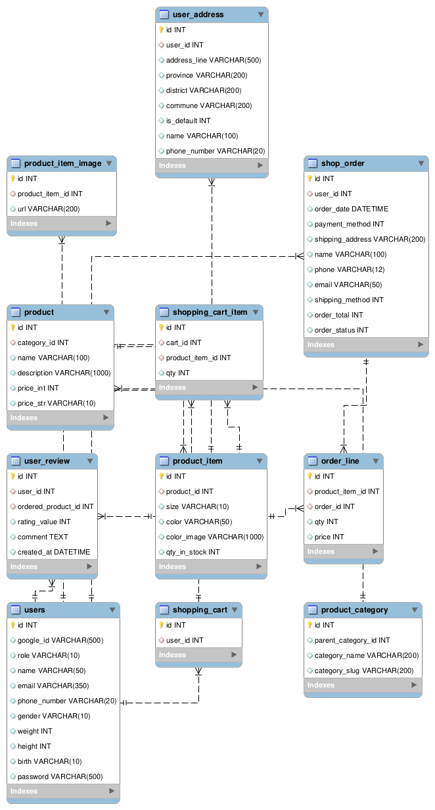

# A RestAPI back-end service for an e-commerce website (Coolmate)

## Table of contents:
- [ Hightlight Features](#head1)
- [ To-do](#head2)
- [ Database Schema](#head3)
- [ How i Dockerize this project and local database](#head4)

## Hightlight Features:
- Planned, built, and fine-tuned a detailed database structure, focusing on making data management smooth and effective through careful and thorough design work.
- Developed comprehensive user and admin management features for an e-commerce platform.
- Developed RestAPI, ensuring to REST architectural principles for clear and consistent communication between client and server components

## To-do:
- [ ] Idempotent
- [ ] Database pooling
- [ ] Debounce and throttle
- [ ] Cloud
- [ ] Exception, error, auth handler,...

## Database Schema

## [How i Dockerize this project and local database](https://toilacube.hashnode.dev/i-should-have-learned-docker-earlier)